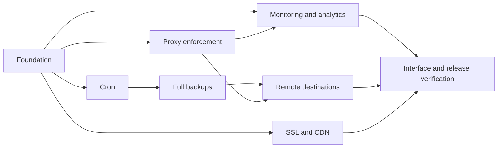
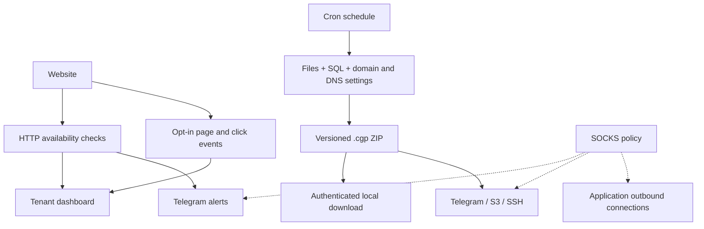

# CGPanel 0.2 release jobs

Status: implementation complete for v0.2.0, a community development alpha. The ten jobs below were used to organize the work before implementation. Verification and external-service boundaries are recorded below.

| Job | Deliverable | Acceptance |
| --- | --- | --- |
| 1 | Additive migrations, persistent jobs, protected integration credentials, upgrade backup | Upgrade preserves accounts, resources and audit history; interrupted jobs are visible |
| 2 | Per-domain HTTP monitoring, response times, incidents, Telegram outage/recovery alerts | Outage and recovery transitions produce bounded notifications |
| 3 | Optional page tracking, views, daily unique IP estimates, referrers, retention | Hashed IP identifiers, bounded ingestion, no cross-tenant reads |
| 4 | Click heatmap and SEO inspection | Aggregate normalized click positions; title, meta description, canonical, robots, sitemap and headings reported from fetched content |
| 5 | Five-field cron, timezone, next run and run history | Container-only commands; no arbitrary root crontab or shell |
| 6 | Full .cgp ZIP archives with files, SQL dumps, domain/DNS settings, manifest and checksums | Restore a fixture site's files and database; archives remain tenant-scoped |
| 7 | Scheduled Telegram/S3/SSH backup delivery, retries and local retention | Transfer errors shown; destination credentials omitted from reads and logs |
| 8 | Let's Encrypt HTTP/DNS challenges, renewal status and CDN zone export | Validation choice persists for renewal; exported BIND zone is importable |
| 9 | SOCKS5 integration transport and enforced application egress proxy | PHP's direct HTTP request exits through proxy; proxy failure does not permit direct egress |
| 10 | Tailwind animations, responsive new pages, reduced motion, documentation and release CI | Browser verification, regression tests and CI pass before release |

## Decisions and boundaries

- Unique IP counts estimate visitors, not distinct people. Store salted hashes scoped to a site and day, never raw IP analytics identifiers. Strip query strings and fragments. Respect Do Not Track; collect no form contents, keystrokes or page text. Click tracking requires adding an opt-in script; default retention is 30 days.
- Checks describe availability from this server's location, not a global monitoring network. SEO checks are observable technical findings, not promised search rankings or invented scores.
- Root operations remain a fixed Rust broker API. Validate ownership in both the panel and broker. Never interpolate tenant input into a root shell command.
- Cron uses five numeric fields with standard day-of-month/day-of-week semantics, an explicit IANA timezone, overlap protection, bounded history and execution timeout. Existing hourly/daily/weekly schedules remain valid.
- A .cgp file is a ZIP container with a versioned manifest, checksums, application files, logical SQL dumps, application configuration, and associated domain/DNS configuration. It contains secrets; only authorized users and explicitly configured storage destinations may receive it. A backup is only complete after all selected components succeed.
- Associate databases explicitly with each backup's application. Do not guess associations from environment variables or collect another tenant's data. Record database engines and restore dependencies.
- Persist queued/running/succeeded/failed job states and bounded sanitized errors. Retry external failures with backoff and avoid overlapping backups. Do not delete a last usable local copy before successful remote delivery.
- Telegram has API upload limits; never label an oversized archive as delivered. Support chunked delivery with a reconstruction manifest or clearly report the size limit. S3 supports custom endpoints and path-style addressing. SSH requires an explicitly supplied host key and no permissive host-key bypass.
- HTTP-01 proves domain control through port 80. DNS-01 supports Cloudflare credentials and authoritative DNS integration. Renewal must run automatically and report failures. IP-only certificates use the supported short-lived profile and compatible ACME client; never imply DNS-01 validates an IP address.
- A BIND zone export helps import records into Cloudflare or another DNS provider. Registrar nameserver changes and CDN activation remain provider-side actions. Never trust arbitrary incoming forwarded-IP headers.
- SOCKS proxy credentials remain separate from backup and Telegram credentials. Host operations and SSH management must retain their normal network path. Enforced application proxying must cover ordinary PHP sockets, resolve DNS through the proxy, block unsupported protocols rather than leak them, and enforce administrator overrides.
- Animations use Tailwind utilities and respect reduced motion. All new pages retain the self-hosted fonts and assets.

## Verification dependencies

No live domain, Telegram token, S3 credentials, SSH destination or SOCKS service was supplied with this request. Controlled fixtures can validate implementation; successful delivery or certificate issuance against a real third-party account must be reported separately.

## Release verification — 2026-09-24

- Rust formatting, Clippy with warnings denied, 11 Rust tests, release compilation, Tailwind generation, JavaScript syntax checks, Python compilation and deployment-script syntax checks pass. The GitHub workflow repeats the portable build checks on pushes and pull requests.
- The upgraded dedicated host passes the original authentication, CSRF, tenant ownership, assigned-domain, DNS, file confinement, legacy backup/restore, scheduling, database ACL and IP-filter tests. Python, PHP, Node.js, Java, Rust and static starter applications all serve HTTP 200 as UID 1000.
- `tests/v2.py` verifies monitoring outage/recovery transitions, analytics IP hashing and ownership, click aggregates, SEO observations, DNS zone export, cron validation, actual scheduled command execution and bounded run history.
- Full `.cgp` archives were inspected and restored into a disposable application's workspace and both MariaDB and PostgreSQL databases. Automatic backup dispatch and two-copy local retention were exercised.
- Controlled HTTPS S3 fixtures verify Signature V4, multipart uploads, deliberate transient failures and retries through authenticated SOCKS. A real local SFTP service verifies pinned SSH keys, rejection of the wrong key and SOCKS routing. TLS certificate verification stays enabled for the S3 fixture.
- Ordinary PHP sockets and hostname lookups traverse the enforced SOCKS gateway. Stopping the proxy blocks outbound requests. Administrator locks, secret retention on edits and API redaction were verified.
- ACME HTTP challenge serving and local authoritative DNS auth/cleanup hooks were exercised. Requests without subscriber agreement and tenant requests for the administrator's panel IP certificate were rejected. The installed renewal timer is active.
- Desktop and phone-width browser checks cover the new navigation, analytics chart and click grid, integration forms, backup configuration and certificate forms. The original self-hosted fonts and Tailwind design are retained; animation utilities honor reduced motion.

Not exercised with real provider accounts: Telegram alert/document delivery, public S3/SSH destinations, Cloudflare DNS API, and Let's Encrypt certificate issuance/renewal. These require account credentials, a reachable domain/IP and the user's certificate agreement. No live third-party delivery or trusted certificate is claimed by these fixture results.

See [the v0.2 guide](V0.2-GUIDE.md) for explicit limits: aggregate heatmaps and daily IP estimates, single-server monitoring, workspace/SQL overlay restore, manual recovery of archived domain/configuration metadata, unencrypted archives, and TCP/DNS-only SOCKS enforcement.

## Official references

- https://core.telegram.org/bots/api
- https://developers.cloudflare.com/dns/manage-dns-records/how-to/import-and-export/
- https://certbot-dns-cloudflare.readthedocs.io/en/stable/
- https://letsencrypt.org/2026/03/11/shorter-certs-certbot/
- https://curl.se/docs/manpage.html
