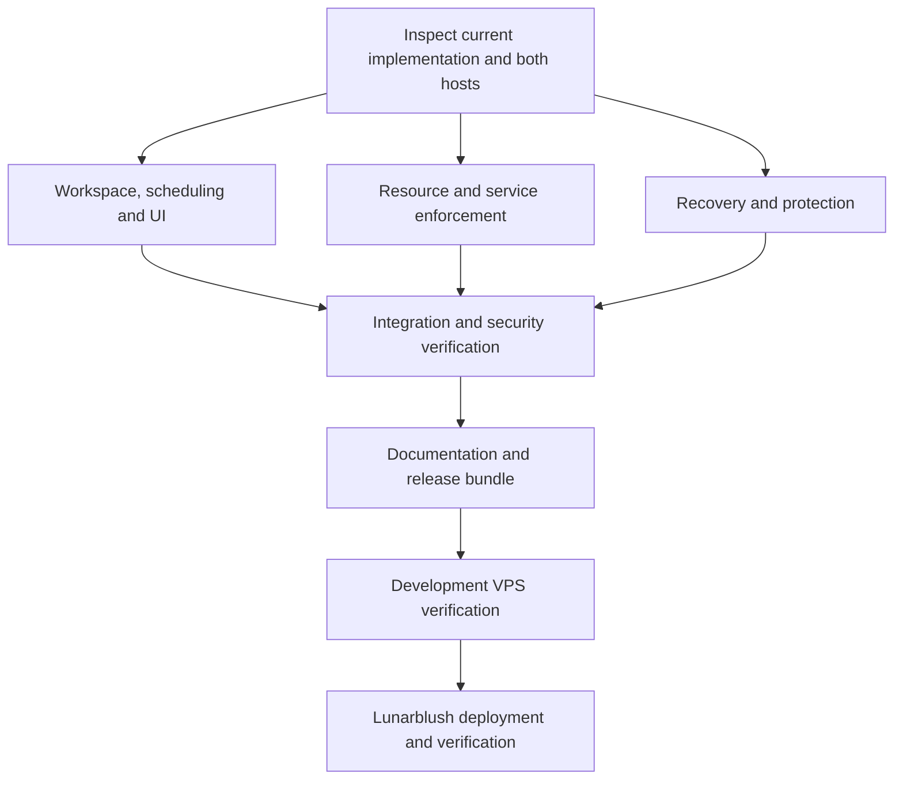

# CGPanel v0.5 implementation and verification plan

Status: in development. This document is a checklist, not a list of shipped features.

| Job | Requested items | Acceptance evidence | Status |
| --- | --- | --- | --- |
| Tenant services | 1 | Pinned-key SFTP transfer and confinement test; certificate-pinned FTPS encrypted round trip passed on development host. Legacy account migration pending. | Partial verification passed |
| Guided workspace | 2, 10 | First-login tour, replay, keyboard access; application explanation | Implemented; integration verification pending |
| Website defaults | 3 | New empty sites get domain-aware coming-soon page; existing content preserved | Implemented; integration verification pending |
| Recovery | 4 | Upload and local archive restore; ownership, traversal, rollback, database verification | Implemented; integration verification pending |
| Scheduling | 5, 6 | Cron presets, next runs, one-click bounded execution with stdout/stderr/status | Implemented; integration verification pending |
| Analytics | 7 | Isolated transport, unique-IP, heatmap, privacy, DNT, origin/key and access tests passed. Browser smoke test pending. | Partial verification passed |
| Resource budgets | 8, 9 | Admin budgets, atomic allocation checks, enforced CPU/RAM/disk, remaining display | Implemented; integration verification pending |
| IDE and tools | 11, 21, 22 | Domain-safe IDE routing, Git tooling, validated runtime catalogue, custom image preservation | Implemented; integration verification pending |
| Console and logs | 12, 13, 26 | Streamed output, completion, clear, app log view, cancellation and tenant isolation | Implemented; integration verification pending |
| Protection | 15, 16, 17 | Enforced request controls, provider/local challenges, crawler rules, sitemap, documented limits | Implemented; integration verification pending |
| Network filters | 18 | IPv4/IPv6 CIDR validation, network range hints, actual DB/firewall enforcement | Implemented; integration verification pending |
| File editor | 19, 20 | Separate editor page, safe media preview, opt-in 10-second autosave, conflict handling | Implemented; integration verification pending |
| Design | 14, 23, 24, 25 | Unique CC0 icons with provenance, generated brand asset, GitHub links, Tailwind glass palette, reduced motion | Implemented; integration verification pending |
| MFA | 15, clarified | Enrollment, mandatory second factor, replay prevention, one-use recovery and password-protected disable tests passed. Browser QA pending. | Partial verification passed |
| Mail hosting | 15, clarified | Mailboxes, TLS IMAP/submission, delivery, quotas, spam controls, DKIM/DNS guidance, relay denial | Local integration passed; public DNS/PTR pending |
| Release | All | API docs, security tests, both VPS upgrade checks, existing Lunarblush runtime and data intact | Not released |

Security wording must distinguish implemented enforcement from an independent security audit and upstream volumetric protection. Neither can be produced by changing this panel. The user explicitly confirmed MFA and full mail hosting are in scope. Neither an independent audit nor upstream volumetric protection is provided by this release.

Runtime selection must describe actually available images, not promise every historical language release. No existing custom runtime is replaced without a requested runtime change.

Development verification: actual ENOSPC at the workspace boundary, migration/file preservation, growth and shrink rejection passed. Container CPU/RAM updates and over-budget rejection passed after fixing stopped-container cgroup updates. A full workspace archive restored successfully with a pre-restore recovery backup and isolated extraction. Database and malicious-archive restore tests also passed.

See [verification record](VERIFICATION-v0.5.md) for completed test evidence. v0.5.0 binaries are deployed on both hosts. See the verification record for results and remaining external mail prerequisites.
